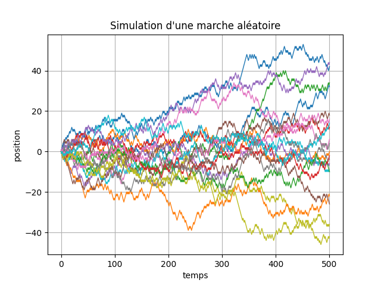
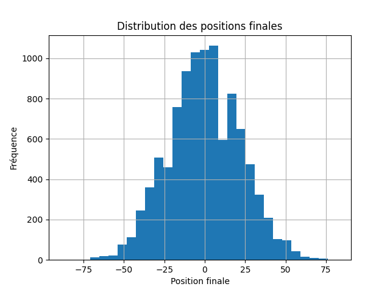

# 🚶 Random Walk Simulation in Python

## 📌 Project Overview

This project simulates one-dimensional random walks using **Python**, **NumPy**, and **Matplotlib**.

A walker starts at position **0**. At each step, it moves either **+1** (to the right) or **−1** (to the left) with equal probability.

The project illustrates the behavior of stochastic processes and shows how repeated random experiments produce meaningful statistical patterns.

---

## 📖 Mathematical Background

Consider independent random variables:

\[
X_i =
\begin{cases}
+1 & \text{with probability } \frac{1}{2},\\
-1 & \text{with probability } \frac{1}{2}.
\end{cases}
\]

The position of the walker after \(n\) steps is

\[
S_n = X_1 + X_2 + \cdots + X_n.
\]

Although each individual step can only take two values, the distribution of the final position becomes approximately **Gaussian (Normal)** as the number of steps increases. This phenomenon is a consequence of the **Central Limit Theorem**.

---

## 🛠 Technologies

- Python
- NumPy
- Matplotlib

---

## 📊 Results

The project generates two visualizations:

### 1️⃣ Multiple Random Walks

Twenty independent random walks of 500 steps are simulated and displayed on the same figure.

They illustrate the randomness and variability of stochastic trajectories.

---

### 2️⃣ Distribution of Final Positions

The final positions of **10,000** independent random walks are collected.

The histogram exhibits a bell-shaped distribution, illustrating the emergence of the Normal distribution.

---

## 🎯 What I Learned

Through this project I learned:

- How to simulate random walks using Python.
- How to generate random variables with NumPy.
- How to visualize stochastic trajectories using Matplotlib.
- How empirical distributions emerge from repeated simulations.
- Why the final positions of random walks approximately follow a Normal distribution.
- The connection between random walks and the Central Limit Theorem.

---

## 🚀 Applications

Random walks are fundamental models used in:

- Quantitative Finance
- Brownian Motion
- Monte Carlo Simulation
- Option Pricing
- Statistical Physics
- Data Science

---

## 👨‍💻 Author

**Mame Thierno Thiam**

Bachelor's Degree in Mathematics – Sorbonne Université

Future Master's Student in Financial Engineering – CY Paris Université
